# Online Medical Clinic Reservation System

## Change History

> 👤 [View Git Blame](https://github.com/khairat1/clinic-reservation-system/blame/main/ARCHITECTURE.md)

| Version | Date | Author | Description |
|---|---|---|---|
| 1.0 | April 2026 | Team   | Initial release |

## Table of Contents

1. [Scope](#1-scope)
2. [References](#2-references)
3. [Software Architecture](#3-software-architecture)
4. [Architectural Goals & Constraints](#4-architectural-goals--constraints)
5. [Logical Architecture](#5-logical-architecture)
6. [Process Architecture](#6-process-architecture)
7. [Development Architecture](#7-development-architecture)
8. [Physical Architecture](#8-physical-architecture)
9. [Scenarios](#9-scenarios)
10. [Size and Performance](#10-size-and-performance)
11. [Quality](#11-quality)

## List of Figures

- [Figure 1 — High-Level Architecture Diagram](#high-level-architecture-diagram)
- [Figure 2 — Class Diagram](#class-diagram)
- [Figure 3 — Process Architecture: Patient Login and Appointment Booking](#61-patient-login-and-appointment-booking)
- [Figure 4 — Process Architecture: AI Chatbot Symptom Analysis](#62-ai-chatbot-symptom-analysis)
- [Figure 5 — Process Architecture: Doctor Views Their Schedule](#63-doctor-views-their-schedule)
- [Figure 6 — Physical Architecture: Deployment Diagram](#83-deployment-diagram)
- [Figure 7 — Scenarios: Use Case Diagram](#91-use-case-diagram)
- [Figure 8 — Scenarios: Patient Books an Appointment](#92-scenario-1-patient-books-an-appointment)
- [Figure 9 — Scenarios: Patient Uses AI Chatbot](#93-scenario-2-patient-uses-ai-chatbot)
- [Figure 10 — Scenarios: Patient Browses Clinic Information](#94-scenario-3-patient-browses-clinic-information)
- [Figure 11 — Scenarios: Admin Manages Doctors and Departments](#95-scenario-4-admin-manages-doctors-and-departments)


## 1. Scope

This document describes the software architecture of the **Online Medical Clinic
Reservation System**, a web-based platform developed as part of the SWE332 Software
Architecture course at Altınbaş University.

The architecture is documented using the **4+1 Architectural View Model**, covering
the logical, process, development, physical, and scenario views of the system.

### What This Document Covers

- The web application architecture (Django backend, HTML/CSS/JS frontend)
- User authentication and role-based access control (Patient, Doctor, Admin)
- Appointment booking system including double-booking prevention
- Doctor and schedule management (Admin functions)
- AI chatbot assistant for symptom-based department recommendation
- PostgreSQL database structure and data flow
- Deployment configuration for local demonstration

### What This Document Does Not Cover

- Payment processing (not part of the system)
- Mobile application development
- Online/cloud deployment (system is demonstrated locally)
- Email notification integration (optional future feature)
- Multilingual support (optional future feature)
- Data analytics or administrative reporting tools
## 2. References

| ID | Source |
|----|--------|
| [1] | Kruchten, P. (1995). *The 4+1 View Model of Architecture*. IEEE Software, 12(6), 42–50. |
| [2] | Django Documentation. https://docs.djangoproject.com |
| [3] | PostgreSQL Documentation. https://www.postgresql.org/docs |
| [4] | Python Software Foundation. https://www.python.org |
| [5] | Mermaid Diagramming Tool. https://mermaid.js.org |
| [6] | GitHub. https://github.com |

## 3. Software Architecture

The Online Medical Clinic Reservation System follows a **Layered
(N-Tier) Architecture**, organized into three primary layers that
separate concerns and promote maintainability.

### Architectural Style: Layered Architecture

In a layered architecture, each layer has a specific responsibility
and only communicates with the layer directly adjacent to it. This
makes the system easier to develop, test, and maintain — especially
for a team working in parallel on different components.

### System Layers

| Layer | Technology | Responsibility |
|---|---|---|
| **Presentation Layer** | HTML, CSS, JavaScript | Renders the user interface for patients, doctors, and admins |
| **Application Layer** | Django (Python) | Handles business logic, routing, authentication, and data processing |
| **Data Layer** | PostgreSQL | Persists all system data — users, appointments, schedules, departments |

### Component Overview

The system is composed of the following main components:

- **Public Web Interface:** Accessible to all visitors. Includes Home,
About Us, Departments, Doctors, and Contact pages.

- **Authentication Module:** Manages user registration, login, and
role-based access control for three roles — Patient, Doctor, and Admin.

- **Appointment Booking Module:** Allows patients to search for doctors
by department and specialty, select available time slots, and confirm
bookings. Prevents double-booking through availability validation.

- **Clinic Management Module:** Used by admins to manage doctor
profiles, departments, and schedules.

- **AI Chatbot Module:** A separate component that accepts symptom
input from patients and recommends the appropriate department. It is
intentionally decoupled from the core booking system to maintain
separation of concerns.

### High-Level Architecture Diagram

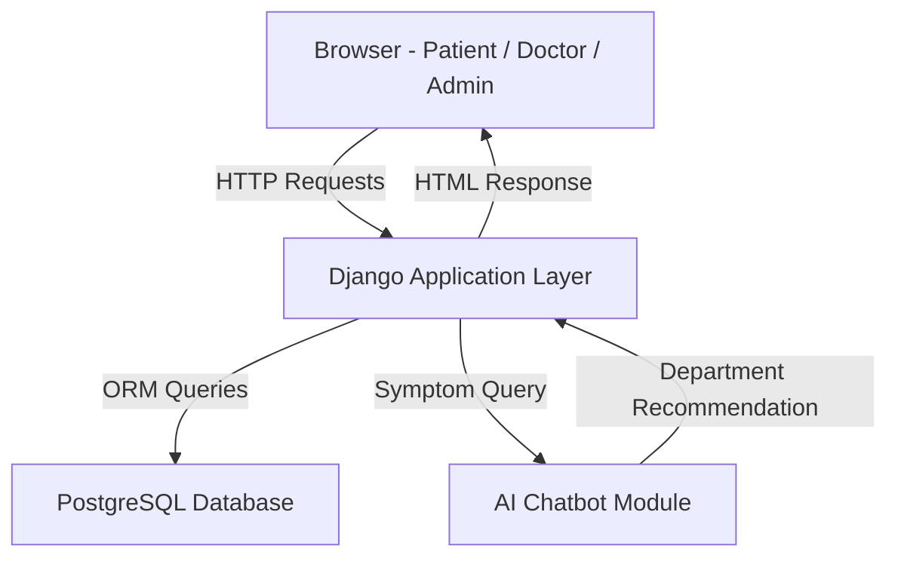

## 4. Architectural Goals & Constraints

### 4.1 Architectural Goals

The following quality goals shaped the key architectural decisions
made in this system:

| Priority | Goal | Description |
|---|---|---|
| High | **Security** | Patient and medical data must be protected. The system enforces role-based access control (Patient, Doctor, Admin) ensuring users can only access what they are authorized to. Passwords are hashed and sessions are managed securely through Django's built-in authentication framework. |
| High | **Usability** | The system targets non-technical users — patients of a medical clinic. The interface must be simple, intuitive, and accessible through any standard web browser without additional software. |
| High | **Reliability** | Appointment booking must be accurate and consistent. The system must prevent double-booking and ensure that confirmed appointments are always stored correctly. |
| Medium | **Maintainability** | The codebase is structured in clearly separated modules (booking, clinic management, AI chatbot) so that individual components can be updated or extended without affecting others. |
| Medium | **Performance** | The system should respond to user actions promptly. Page loads and booking confirmations should complete within acceptable time for a smooth user experience. |
| Low | **Scalability** | While the current scope is a university project, the layered architecture and modular design allow the system to scale to more users or departments in the future. |

---

### 4.2 Architectural Constraints

Constraints are limitations imposed on the system that shaped
architectural decisions — not choices, but boundaries the team
must work within.

#### Technical Constraints

- **Django Framework:** The backend must be implemented using Django
(Python). This was decided at project inception and is non-negotiable.
- **PostgreSQL Database:** The system uses PostgreSQL as its relational
database. All data relationships (patients, doctors, appointments) must
conform to a structured relational schema.
- **Browser-Based Frontend:** The frontend must run in a standard web
browser using HTML, CSS, and JavaScript — no native mobile apps or
browser plugins required.
- **AI Chatbot Integration:** The chatbot module must integrate with
the Django backend through a defined interface while remaining
independently maintainable.

#### Business Constraints

- **Academic Deadline:** The project must be completed within the
semester timeline. This limits the scope of features and influenced
the choice of familiar, well-documented technologies.
- **Team Size:** The system is built by a five-person student team,
each responsible for a specific component. Architecture must support
parallel development with minimal dependencies between members.
- **No Budget:** The project relies entirely on free and open-source
tools. No paid APIs, cloud services, or licensed software may be used.

#### Regulatory Constraints

- **Data Privacy:** Medical appointment data is sensitive. Even as a
university project, the system design acknowledges that in a real
deployment, patient data would be subject to privacy regulations.
Role-based access control and secure authentication are implemented
with this in mind.

## 5. Logical Architecture

### Overview

The Logical Architecture describes the key classes of the Online Medical
Clinic Reservation System, their attributes, responsibilities, and
relationships. It supports the functional requirements by decomposing
the system into meaningful objects derived from the problem domain.

The system follows an object-oriented design. The core entities are
`User`, `Patient`, `Doctor`, `Admin`, `Department`, `Appointment`,
`Schedule`, and `AIChat`. These classes interact to support appointment
booking, clinic management, and AI-assisted department guidance.

### Key Design Decisions

**1. User as a Base Class**
`Patient`, `Doctor`, and `Admin` all inherit from `User`. This avoids
duplicate authentication logic and supports role-based access control
from a single login system. Every actor in the system is a User first,
with their role determining what they can access.

**2. Appointment as a Central Entity**
`Appointment` connects `Patient` and `Doctor`. It is the core
transaction object of the entire system — every booking interaction
passes through it.

**3. Schedule Separate from Appointment**
`Schedule` represents a doctor's general availability (e.g., "every
Monday 9am–12pm"). `Appointment` represents a specific confirmed
booking within that availability. Keeping them separate allows the
system to check availability before confirming a booking, which is
what prevents double-booking.

**4. AIChat Linked to Patient Only**
The AI chatbot exists to guide patients who are unfamiliar with the
clinic structure toward the right department based on their symptoms.
Doctors already belong to a department and need no guidance. Admins
manage the system and have no use for medical recommendations.
Every relationship in a class diagram should exist for a reason —
connecting AIChat to Doctor or Admin would add associations with zero
functional purpose.

### Class Diagram

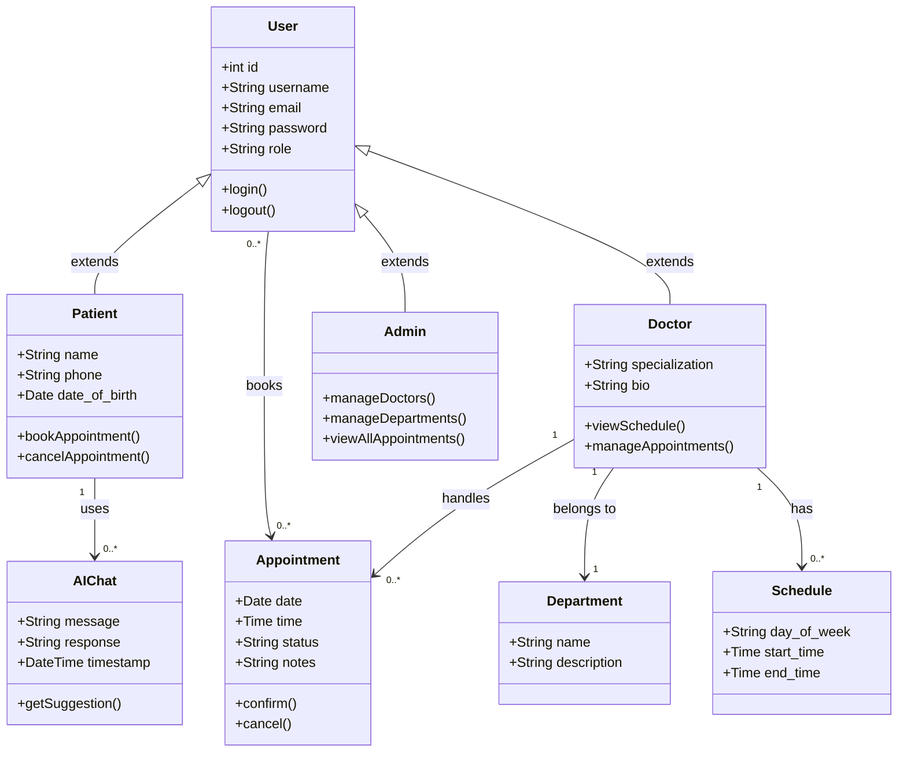
## 6. Process Architecture

The Process Architecture describes the dynamic behavior of the Online Medical 
Clinic Reservation System at runtime. It illustrates how the system's components 
interact during key operations, focusing on request flows, data exchange, and 
decision points. This view is represented using UML Sequence Diagrams.

### 6.1 Patient Login and Appointment Booking

This diagram illustrates the most critical flow in the system — a patient 
authenticating and booking an appointment with a doctor. It includes 
double-booking prevention logic.

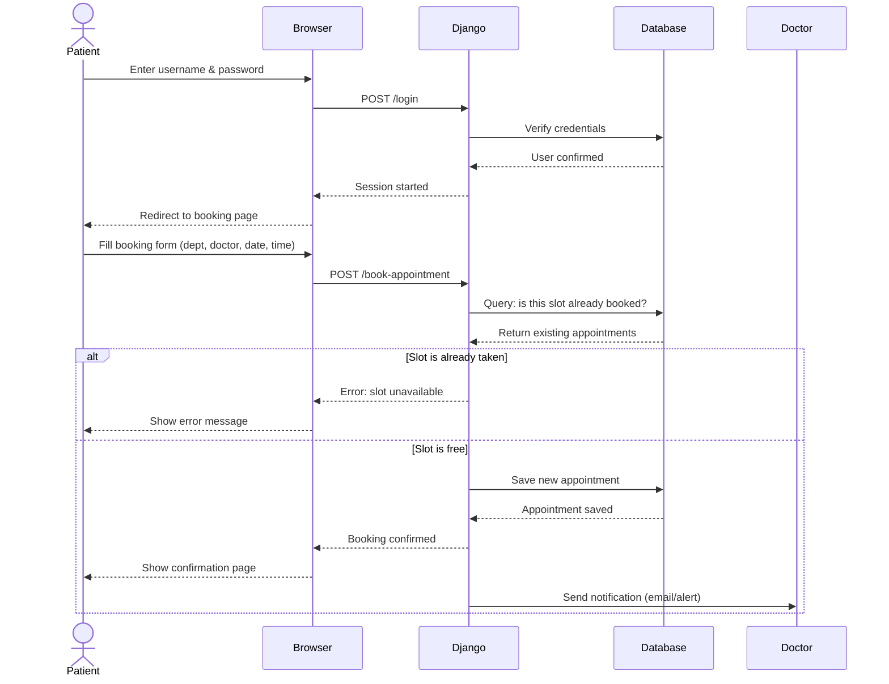

### 6.2 AI Chatbot Symptom Analysis

This diagram shows how the AI chatbot module processes patient symptoms 
and recommends the appropriate department. It highlights the interaction 
between Django and the AI module, as well as conversation logging.

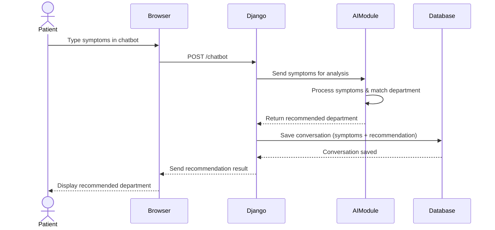

### 6.3 Doctor Views Their Schedule

This diagram illustrates how a doctor accesses their appointment schedule 
after authentication. It handles both the case where appointments exist 
and where none are found.

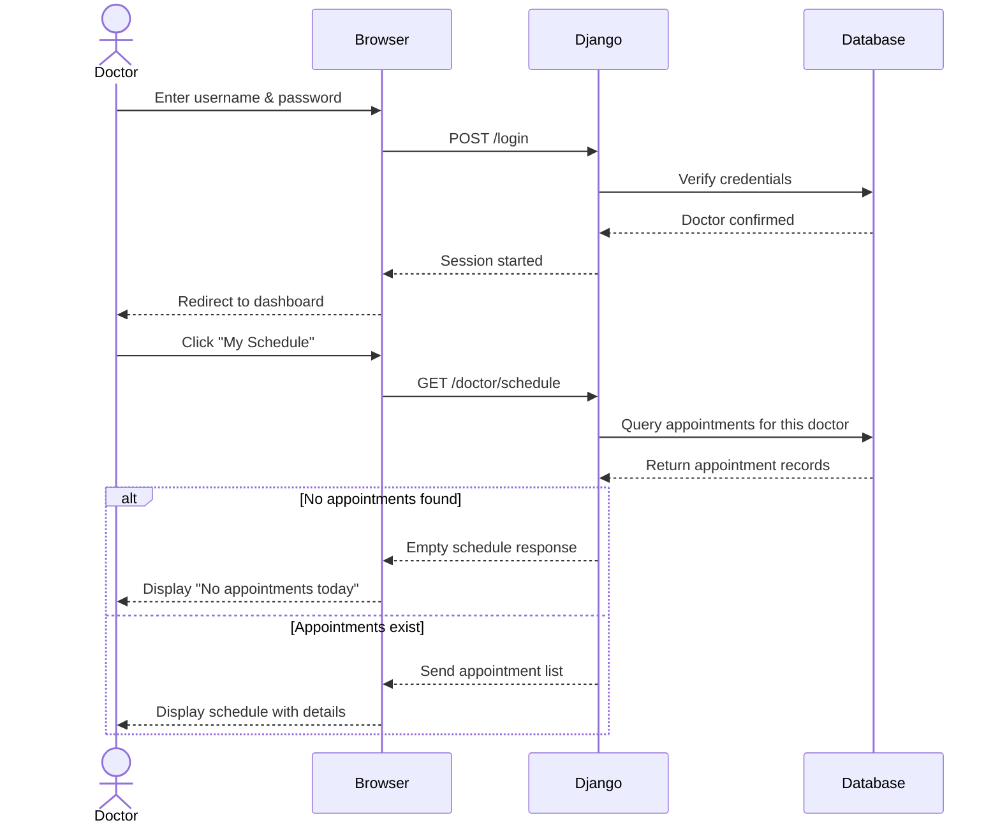


# 7. Development Architecture

The Development Architecture describes how the source code of the Online Medical Clinic Reservation System is organized into modules, layers, and packages. It shows the folder structure, the Django apps, how they depend on each other, and which technologies are used. This view is primarily intended for developers and project managers.

---

## 7.1 Project Modules

The system is organized into four Django applications, a shared templates directory, a static files directory, and a project configuration package. Each app is independently maintainable and was developed by a separate team member.

| **Module** | **Type** | **Responsibility** |
|---|---|---|
| Accounts | Django app | User registration, login, logout, role management |
| Appointments | Django app | Appointment booking, cancellation, rescheduling |
| Clinic | Django app | Doctors, departments, schedules, public pages, admin management |
| Chatbot | Django app | AI-powered symptom-to-department assistant |
| templates/ | Folder | All HTML template files for the entire system |
| static/ | Folder | All CSS, JavaScript, and image files |
| clinic_project/ | Config | Django settings, main URL router, WSGI entry point |
| PostgreSQL | Database | Persistent storage for all system data |
| AI / LLM API | External | Natural language processing for chatbot |

---

## 7.2 Main Package Diagram

The system follows a 5-layer architecture. Each layer communicates only with the layer directly below it.

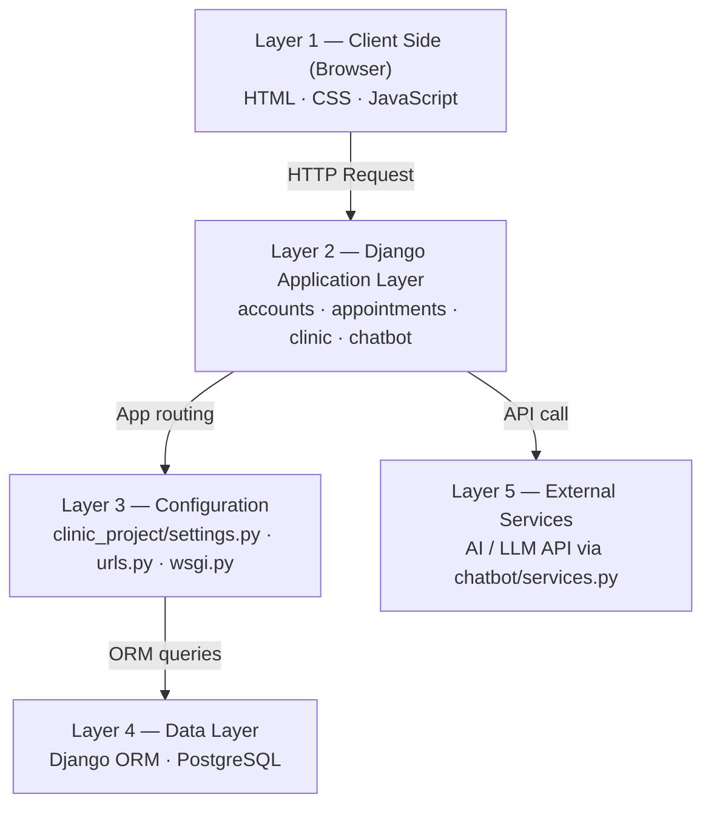


---

## 7.3 MVT Pattern — Appointments App

Django follows the MVT (Model-View-Template) pattern. The appointments app is the most complex and demonstrates the full MVT flow clearly.

| **MVT Component** | **File** | **Responsibility in Appointments** |
|---|---|---|
| Template (T) | book.html, confirmation.html, my_appointments.html, cancel.html, reschedule.html | HTML pages the patient sees — booking form, confirmation, list of appointments |
| View (V) | views.py — book_appointment(), cancel_appointment(), get_appointments() | Receives form data, checks login, validates input, prevents double-booking |
| Model (M) | models.py — Appointment, BookingForm | Defines appointment data structure and validates form fields before saving |

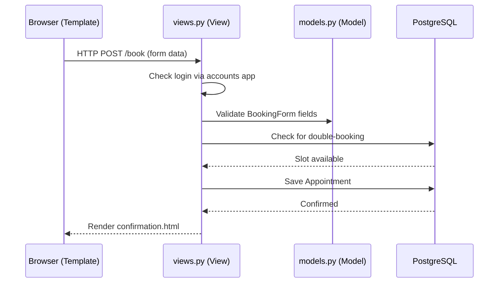


---

## 7.4 Module Descriptions

### accounts app

Responsible for all user-related functionality. Handles registration, login, logout, profile management, and role-based access control. Three roles exist: Patient, Doctor, and Admin. Files: `models.py`, `views.py`, `urls.py`, `forms.py`, `admin.py`, `migrations/`.

### appointments app

The core booking engine. Allows patients to select a department, doctor, date, and time slot. Prevents double-booking by checking existing records before confirming. Files: `models.py`, `views.py`, `urls.py`, `forms.py`, `admin.py`, `migrations/`.

### clinic app

Manages all clinic-related content. Public pages: Home, About, Departments, Doctors, Contact. Admin views allow adding doctors, departments, and setting weekly schedules. Files: `models.py`, `views.py`, `urls.py`, `admin.py`, `migrations/`.

### chatbot app

AI-powered symptom guidance assistant. Patient describes symptoms in natural language and the chatbot suggests the most appropriate department. All AI API communication is isolated inside `services.py` — if the provider changes, only this one file needs updating.

| **File** | **Responsibility** |
|---|---|
| models.py | Defines ChatHistory model to store conversations |
| views.py | Receives user messages, calls services, returns AI response |
| urls.py | Routes /chat |
| services.py | Handles all communication with the external AI API |
| admin.py | Exposes chat history in Django admin panel |

### templates/ folder

Contains all HTML files organized into subfolders matching each app. `base.html` defines the shared layout — navigation, header, footer.

```
templates/
|-- base.html              (shared layout + navbar)
|-- accounts/              (login, register, profile)
|-- appointments/          (book, confirm, cancel, reschedule, my-appointments)
|-- clinic/                (home, about, departments, doctors, contact)
|-- admin_panel/           (departments, doctors, schedules, appointments)
|-- doctors/               (schedule, report)
|-- chatbot/               (chat interface)
```

### static/ folder

Contains all CSS, JavaScript, and image files.

```
static/
|-- css/      (main.css, appointments.css, chatbot.css)
|-- js/       (main.js, booking.js, chatbot.js, schedule.js)
|-- images/   (logo.png, doctors/, departments/)
```

### Configuration (clinic_project/)

| **File** | **Responsibility** |
|---|---|
| settings.py | Database config, installed apps, static files, middleware |
| urls.py | Main URL router — delegates to each app urls.py |
| wsgi.py | Web server entry point — starts Django for incoming requests |
| asgi.py | Async server entry point |

---

## 7.5 Module Dependencies

| **Module** | **Depends On** | **Reason** |
|---|---|---|
| Appointments | accounts | Patient must be logged in before booking |
| Appointments | clinic | Booking form needs departments, doctors, and time slots |
| Chatbot | accounts | User must be logged in before chatting |
| Chatbot | AI / LLM API | Cannot generate suggestions alone — sends symptoms via services.py |
| Clinic | accounts | Admin pages restricted to Admin role defined in accounts |
| All apps | Django ORM | Every app reads/writes data through ORM which generates SQL |
| All apps | settings.py | Every app registered in INSTALLED_APPS, relies on database config |

### Key Dependency Rules

- **Rule 1 — Layered dependency:** Each layer only calls the layer below it. Templates call views, views call models, models call the database.
- **Rule 2 — No circular dependencies:** No app imports from another app directly. Cross-app data is passed through views and URL parameters.
- **Rule 3 — External isolation:** AI API accessed only through `chatbot/services.py`. If provider changes, only one file needs updating.

---

## 7.6 Technology Stack

| **Layer** | **Technology** | **Version** | **Purpose** | **Why Chosen** |
|---|---|---|---|---|
| Frontend | HTML5 | 5 | Page structure | Standard markup, works in all browsers |
| Frontend | CSS3 | 3 | Visual styling | Controls colors, spacing, responsiveness |
| Frontend | JavaScript | ES6+ | Interactive behavior | Booking form dynamics and chatbot UI |
| Backend | Python | 3.x | Server-side language | Clean syntax, Django is built on it |
| Backend | Django | 4.x | Web framework (MVT) | Rapid dev, built-in ORM, auth, admin |
| Backend | Django ORM | built-in | Database abstraction | Write Python not SQL, prevents injection |
| Database | PostgreSQL | 14+ | Relational database | Handles structured relational data perfectly |
| AI Module | AI / LLM API | external | Symptom guidance | Natural language understanding for chatbot |
| Server | WSGI | built-in | Web server interface | Standard Django deployment interface |
| Version Control | Git + GitHub | latest | Source control | Required, supports branch workflow |
| Documentation | Markdown | — | Architecture docs | Renders natively on GitHub |
| Diagrams | Mermaid | — | Diagrams in Markdown | Renders in GitHub without external tools |

---

## 7.7 Project Folder Structure

```
clinic_project/                  (Root project folder)
|-- manage.py                    (Django CLI tool)
|-- requirements.txt             (Python dependencies)
|-- clinic_project/              (Project configuration)
|   |-- settings.py              (Database, apps, static config)
|   |-- urls.py                  (Main URL router)
|   |-- wsgi.py                  (Web server entry point)
|   |-- asgi.py                  (Async server entry point)
|-- accounts/                    (User management app)
|   |-- models.py · views.py · urls.py · forms.py · admin.py · migrations/
|-- appointments/                (Booking system app)
|   |-- models.py · views.py · urls.py · forms.py · admin.py · migrations/
|-- clinic/                      (Clinic management app)
|   |-- models.py · views.py · urls.py · admin.py · migrations/
|-- chatbot/                     (AI assistant app)
|   |-- models.py · views.py · urls.py · services.py · admin.py · migrations/
|-- templates/                   (All HTML files)
|   |-- base.html · accounts/ · appointments/ · clinic/ · admin_panel/ · doctors/ · chatbot/
|-- static/                      (All CSS, JS, Images)
|   |-- css/ · js/ · images/
```

**Database tables (PostgreSQL):**
`accounts_user` · `appointments_appointment` · `clinic_doctor` · `clinic_department` · `clinic_schedule` · `chatbot_history`

## 8. Physical Architecture

The Physical Architecture describes the mapping of software
components onto physical hardware nodes and the communication
paths between them. It answers the question: **where does each
part of the system actually run?**

### 8.1 System Nodes

The Online Medical Clinic Reservation System is deployed across
the following physical nodes:

| Node | Description |
|---|---|
| **Client Device** | The end user's machine (laptop, desktop, or mobile). Runs a standard web browser. No installation required. |
| **Web Application Server** | Hosts the Django application. Handles all HTTP requests, business logic, authentication, and routing. |
| **Database Server** | Runs PostgreSQL. Stores and manages all persistent data — users, doctors, appointments, departments, and schedules. |
| **AI Chatbot Module** | A separate Python-based component deployed alongside the Django server. Processes symptom input and returns department recommendations. |

---

### 8.2 Communication Protocols

| Connection | Protocol | Description |
|---|---|---|
| Client → Web Server | HTTP/HTTPS | Browser sends requests; server returns HTML responses |
| Web Server → Database | SQL via Django ORM | Django queries PostgreSQL using its Object-Relational Mapper |
| Web Server → AI Chatbot | Internal Python call | Django invokes the chatbot module directly within the server environment |

---

### 8.3 Deployment Diagram

The following UML deployment diagram illustrates how software
artifacts are distributed across physical nodes and how those
nodes communicate:

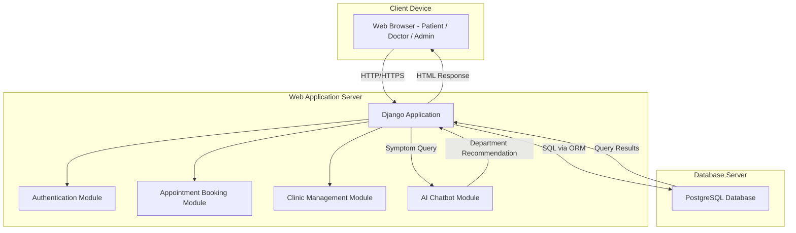

---

### 8.4 Physical Architecture Decisions

**Why is the AI Chatbot on the same server as Django?**
For a university-scale project, hosting the chatbot as a separate
deployable module within the same server environment reduces
infrastructure complexity while still maintaining separation of
concerns at the code level. In a production system, it could be
extracted to its own dedicated server or cloud function.

**Why PostgreSQL?**
PostgreSQL is a robust, open-source relational database that
integrates seamlessly with Django through its ORM. The relational
model suits the structured nature of clinic data — patients,
doctors, appointments, and departments all have well-defined
relationships.

**Why browser-based frontend?**
Deploying a web-based frontend requires no installation on the
client device. Any patient or doctor with a standard browser can
access the system — maximizing accessibility with zero client-side
deployment effort.

## 9. Scenarios

The Scenarios view represents the **+1** in the 4+1 Architectural View Model.
It describes the most significant use cases of the system and demonstrates how
the architecture supports them. Each scenario involves one or more actors
interacting with the system, and illustrates how the logical, process,
development, and physical views work together in practice.

---

### 9.1 Use Case Diagram

The following diagram shows the main actors and their interactions with the
Online Medical Clinic Reservation System.
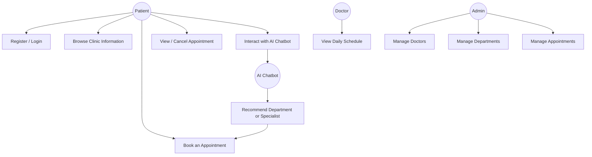

---

### 9.2 Scenario 1: Patient Books an Appointment

**Actor:** Patient
**Goal:** Book an appointment with a doctor by selecting department, date, and time.
**Precondition:** Patient is registered and logged in.
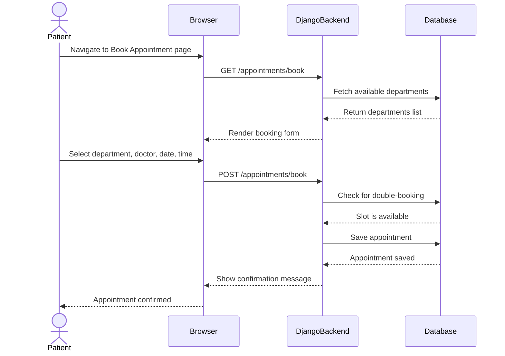

---

### 9.3 Scenario 2: Patient Uses AI Chatbot

**Actor:** Patient
**Goal:** Get a department or specialist recommendation based on symptoms.
**Precondition:** Patient is on the chatbot page.
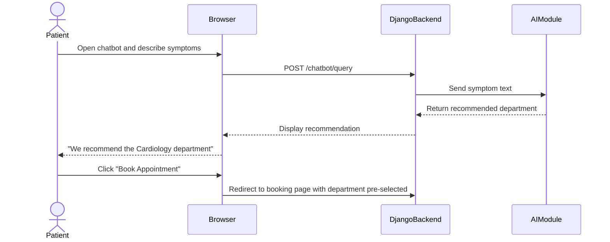

---

### 9.4 Scenario 3: Patient Browses Clinic Information

**Actor:** Patient (unauthenticated)
**Goal:** Learn about the clinic, departments, and doctors before registering.
**Precondition:** None — public pages are accessible without login.
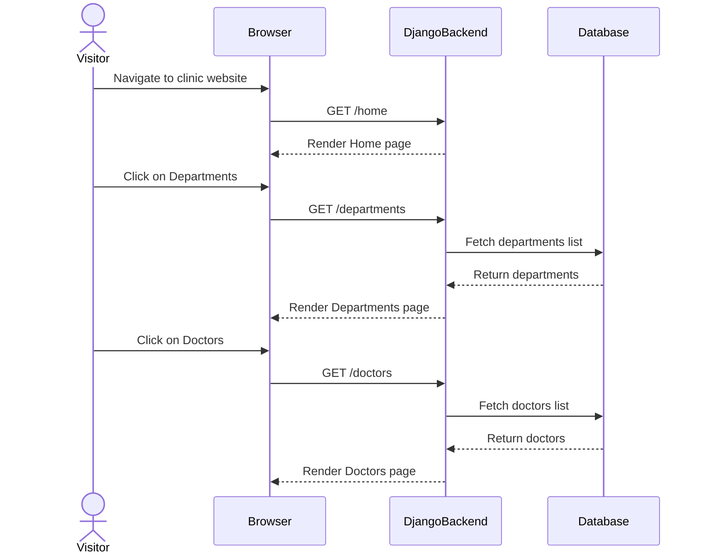

---

### 9.5 Scenario 4: Admin Manages Doctors and Departments

**Actor:** Admin
**Goal:** Add a new doctor and assign them to a department.
**Precondition:** Admin is logged in with admin privileges.

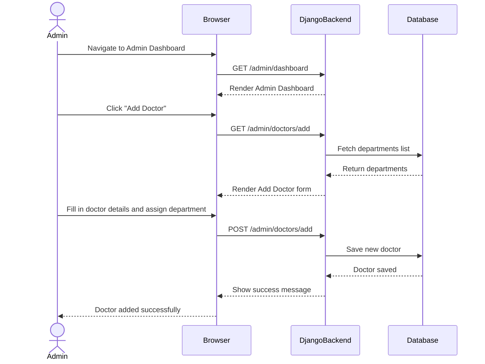

---

## 10. Size and Performance
his section documents the expected size of the Online Medical Clinic Reservation System and defines measurable performance targets. All figures are based on a single clinic complex. The system is classified as a small-to-medium web application and does not require enterprise-level infrastructure in Year 1.

---

## 10.1 System Size Estimates

The system consists of 4 Django apps, approximately 25 HTML templates, 20 Python source files, and an estimated 3,000–5,000 lines of code. It serves around 500 registered patients, 20–30 doctors, and 8–10 departments in its first year, managed by 2–5 admin users. Data is stored across 6 PostgreSQL tables.

---

## 10.2 Response Time Targets

| **Action** | **Target** | **Why** |
|---|---|---|
| Home / public pages | < 1.5 seconds | No or minimal DB queries |
| Login / Register | < 1.0 second | Single user table lookup |
| Booking form load | < 2.0 seconds | Fetches doctors, departments, slots |
| Appointment confirmation | < 2.0 seconds | Writes to DB, checks double-booking |
| Admin dashboard | < 3.0 seconds | Multiple queries across tables |
| Chatbot first response | < 5.0 seconds | External AI API round-trip |

> *Industry standard is under 2 seconds. The chatbot is the only exception due to its external AI API dependency.*

---

## 10.3 Throughput and Concurrent Users

The system targets 20–30 concurrent users during normal hours and up to 50 at peak (typically mornings when patients compete for slots). This translates to 80–100 requests per minute normally and 250–300 at peak. These numbers are fully achievable on a standard single-server Django + PostgreSQL deployment.

---

## 10.4 Database Size Estimates

| **Table** | **Year 1** | **Year 2** | **Year 3** |
|---|---|---|---|
| accounts_user | 500 rows | 800 rows | 1,200 rows |
| appointments_appointment | 5,000 rows | 12,000 rows | 20,000 rows |
| clinic_doctor | 30 rows | 35 rows | 40 rows |
| clinic_department | 10 rows | 12 rows | 12 rows |
| clinic_schedule | 200 rows | 250 rows | 300 rows |
| chatbot_history | 2,000 rows | 5,000 rows | 9,000 rows |
| **TOTAL** | **~7,740 rows** | **~18,097 rows** | **~30,552 rows** |

> *~7,740 records after Year 1 — well within PostgreSQL optimal range. No partitioning or sharding needed at this scale.*

---

## 10.5 AI Chatbot Performance

The chatbot's response time depends on an external AI/LLM API and is partially outside the system's control. The target is under 5 seconds per response, with a hard timeout of 10 seconds. If the API is unavailable, patients are automatically redirected to manual department selection. The chatbot is limited to 20 concurrent sessions due to typical API rate limits (~60 req/min). A disclaimer is always shown reminding patients that the chatbot does not replace professional medical diagnosis.

---


## 10.7 Performance Constraints

| **Constraint** | **Impact** | **Mitigation** |
|---|---|---|
| AI API rate limit (~60 req/min) | Chatbot may queue at peak | Limit concurrent sessions to 20 |
| AI API latency (2–4 sec) | Chatbot slower than other pages | Show typing indicator while waiting |
| Single server deployment | ~50 concurrent users max | Upgrade path exists for Year 2+ |
| No caching in Year 1 | Repeated DB queries for same data | Add Django cache framework in Year 2 |
| Shared PostgreSQL server | DB and app on same machine | Separate DB server as traffic grows |

## 11. Quality
 This section defines the quality attributes of the Online Medical Clinic Reservation System. It includes a quality goals table, a quality tree diagram, and measurable quality scenarios for each attribute.

---

## 11.1 Quality Goals

| **Quality Attribute** | **Priority** | **Reason** |
|---|---|---|
| Security | HIGH | Patient data and medical records must be protected. Unauthorized access is unacceptable in a medical system. |
| Usability | HIGH | Patients of all ages and technical abilities must be able to book appointments easily without training. |
| Reliability | HIGH | The system must prevent double-bookings and be available during clinic working hours without failures. |
| Performance | HIGH | Pages must load fast. Slow systems cause patients to abandon bookings and lose trust in the clinic. |
| Maintainability | MEDIUM | The team must be able to add new features or fix bugs without breaking existing functionality. |
| Portability | LOW | The system should run on different operating systems and be easy to deploy on a new server if needed. |

---

## 11.2 Quality Tree

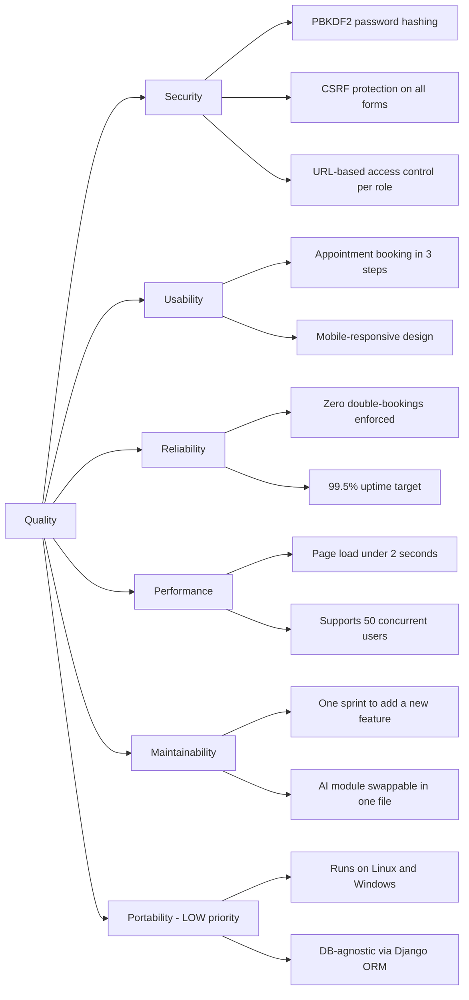

## 11.3 Quality Scenarios

The following scenarios describe the measurable behavior expected from the system for each quality attribute.

### 11.3.1 Security

**Scenario:** A patient attempts to access another patient's appointment page by manipulating the URL.  
**Source:** Unauthorized user  
**Stimulus:** Direct URL access to a restricted resource  
**Response:** Django session middleware blocks the request and returns HTTP 403  
**Measure:** 0 unauthorized data exposures; all passwords hashed using PBKDF2; CSRF tokens validated on every form submission

---

### 11.3.2 Usability

**Scenario:** A first-time patient visits the clinic website and wants to book an appointment.  
**Source:** Patient (no prior training)  
**Stimulus:** User navigates the booking flow for the first time  
**Response:** The system guides the user through department → doctor → date/time selection in 3 steps  
**Measure:** Booking completed in under 3 minutes; UI is fully responsive on mobile and desktop

---

### 11.3.3 Reliability

**Scenario:** Two patients attempt to book the same doctor slot at the same time.  
**Source:** Two concurrent patients  
**Stimulus:** Simultaneous booking requests for the same time slot  
**Response:** Django database transaction ensures only one booking succeeds; the second receives a clear conflict message  
**Measure:** 0 double-bookings allowed; system available 99.5% of the time during clinic working hours

---

### 11.3.4 Performance

**Scenario:** A patient loads the Doctors listing page during peak hours.  
**Source:** Patient  
**Stimulus:** HTTP GET request to `/doctors/`  
**Response:** Django ORM fetches data using optimized queries; PostgreSQL indexed fields reduce query time  
**Measure:** Page load under 2 seconds; system handles up to 50 concurrent users without degradation

---

### 11.3.5 Maintainability

**Scenario:** The team needs to swap the AI chatbot provider or add a new medical department.  
**Source:** Developer  
**Stimulus:** Change request to an existing feature  
**Response:** The modular MVT structure allows changes to one Django app without affecting others; AI logic is isolated in `services.py`  
**Measure:** New feature deliverable within one sprint; replacing the AI module requires changing only 1 file

---

## 11.4 Quality Summary

| **Attribute** | **Priority** | **Key Target** | **How Achieved** |
|---|---|---|---|
| Security | HIGH | 0 plain-text passwords, 100% CSRF protection | Django built-in: PBKDF2 hashing, CSRF middleware, ORM |
| Usability | HIGH | Booking in under 3 steps, mobile responsive | Clean HTML templates, responsive CSS, inline errors |
| Reliability | HIGH | 99.5% uptime, 0 double-bookings | DB transaction check, Django session management |
| Performance | HIGH | Pages < 2s, 50 concurrent users supported | Django ORM optimization, PostgreSQL indexing |
| Maintainability | MEDIUM | New feature in 1 sprint, 1 file to swap AI | MVT pattern, isolated apps, services.py for AI |
| Portability | LOW | Runs on Linux/Windows, DB-agnostic | Django ORM, Python cross-platform, WSGI standard |

## Appendices

### A. Acronyms and Abbreviations

The following acronyms and abbreviations are used throughout this document:

| Abbreviation | Full Form | Description |
|---|---|---|
| AI | Artificial Intelligence | The technology powering the symptom-based chatbot module |
| API | Application Programming Interface | A bridge that allows software components to communicate |
| CSS | Cascading Style Sheets | The styling language used for the frontend user interface |
| DB | Database | The persistent storage layer — PostgreSQL in this system |
| Django | Django Web Framework | The Python-based backend framework used in this project |
| HTTP | Hyper Text Transfer Protocol | The protocol used for communication between browser and server |
| HTTPS | Hyper Text Transfer Protocol Secure | Encrypted version of HTTP used for secure data transmission |
| JS | JavaScript | The scripting language used in the frontend |
| MVC | Model View Controller | The architectural pattern Django is based on |
| SQL | Structured Query Language | The language used to query and manage the PostgreSQL database |
| UI | User Interface | The visual layer that users interact with in the browser |
| UML | Unified Modeling Language | The standard notation used for architectural diagrams in this document |
| URL | Uniform Resource Locator | A web address used to access system endpoints |
| 4+1 | 4+1 Architectural View Model | The documentation framework used to describe this system's architecture |

### Definitions

| Term | Definition |
|------|------------|
| Appointment | A confirmed booking between a Patient and a Doctor at a specific date and time |
| Authentication | The process of verifying a user's identity via username and password |
| AI Chatbot | An automated assistant that recommends departments based on patient-described symptoms |
| Department | A medical specialty unit within the clinic (e.g., Cardiology, Neurology) |
| Double-Booking | A conflict where two appointments are scheduled for the same doctor at the same time — prevented by the system |
| Django | A Python-based web framework used to build the backend of this system |
| PostgreSQL | The relational database system used to store all clinic data |
| Role-Based Access Control | A security model where system permissions are assigned based on a user's role (Patient, Doctor, Admin) |
| Schedule | A doctor's defined availability — the days and times they are open for bookings |
| UML | Unified Modeling Language — a standard notation for visualizing software architecture |
### Design Principles

This appendix documents the core design principles that guided
the architectural and development decisions made in the Online
Medical Clinic Reservation System. These principles were not
applied retroactively — they shaped decisions from the beginning
of the design process.

---

#### 1. Separation of Concerns (SoC)

**Definition:** Each component or module of the system should be
responsible for one distinct aspect of functionality, with minimal
overlap between components.

**Application in this system:**
The system is divided into clearly distinct modules — Appointment
Booking, Clinic Management, Authentication, and the AI Chatbot.
Each module handles one domain of functionality and does not
interfere with the others. For example, a change in the AI Chatbot
logic has no impact on the appointment booking workflow.

---

#### 2. Single Responsibility Principle (SRP)

**Definition:** Every module, class, or component should have one
job and one reason to change.

**Application in this system:**
The AI Chatbot module has a single responsibility — analyzing
patient symptoms and recommending a department. It does not handle
booking, authentication, or data management. Similarly, the
Authentication Module is solely responsible for managing user
identity and access — nothing else. If an error occurs in one
module, it does not cascade and break the rest of the system.

---

#### 3. Security by Design

**Definition:** Security measures are built into the architecture
from the beginning — not added as an afterthought.

**Application in this system:**
Security was considered at the design stage across multiple layers:
- **Authentication:** All users must log in before accessing any
protected resource. Django's built-in authentication framework
manages session handling and password hashing.
- **Role-Based Access Control (RBAC):** Three roles are defined —
Patient, Doctor, and Admin. Each role can only access what it is
authorized to. Patients can only view their own appointments and
personal information. Doctors can only manage their own schedules.
Admins have full system access.
- **Data Privacy:** No user can access another user's personal or
medical data — this is enforced at the application logic level
within Django.

---

#### 4. Layered Architecture Principle

**Definition:** The system is organized into distinct layers where
each layer only communicates with the layer directly adjacent to it.

**Application in this system:**
The three-layer structure — Presentation (Frontend), Application
(Django), and Data (PostgreSQL) — ensures that the frontend never
directly accesses the database. All data flows through the Django
application layer, which validates, processes, and controls what
data is read or written. This protects data integrity and makes
each layer independently testable.

---

#### 5. DRY — Don't Repeat Yourself

**Definition:** Every piece of knowledge or logic should exist in
exactly one place in the system. Repetition leads to
inconsistency and maintenance difficulty.

**Application in this system:**
Django's templating system allows shared UI components — such as
the navigation bar, header, and footer — to be defined once and
reused across all pages. Business logic such as availability
checking for appointments is implemented once in the backend and
called wherever needed, rather than duplicated across multiple
views or endpoints.

---

#### 6. Modularity

**Definition:** The system is built as a collection of independent,
interchangeable modules that can be developed, tested, and updated
separately.

**Application in this system:**
The five-person development team worked in parallel by owning
separate modules — Frontend, Appointment Booking Backend, Clinic
Management Backend, and AI Chatbot. Modularity made this possible
because each module had a defined interface and responsibility.
Updating the chatbot algorithm, for example, requires no changes
to the booking or management modules.
