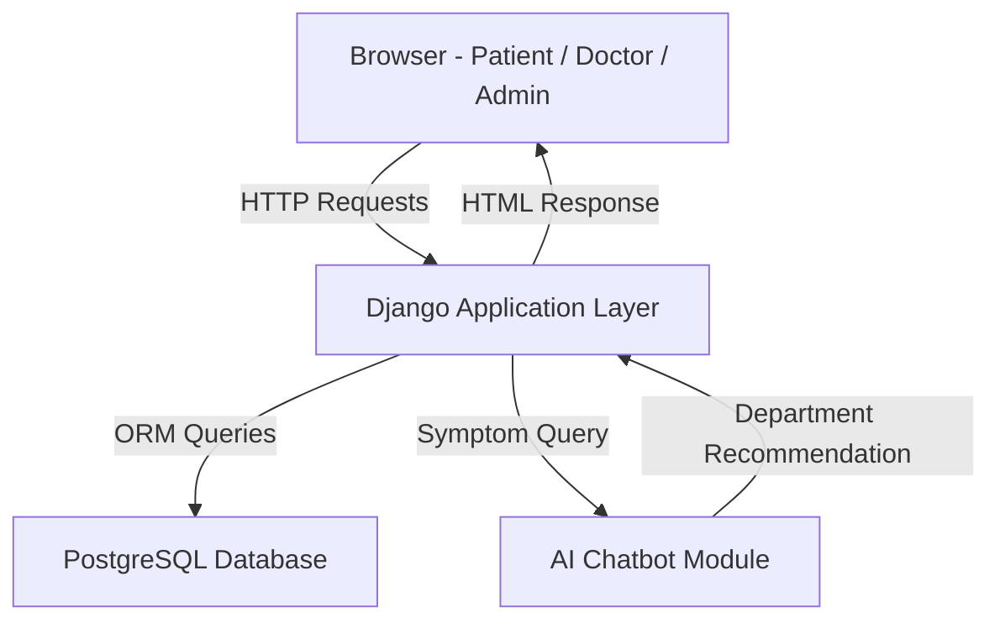
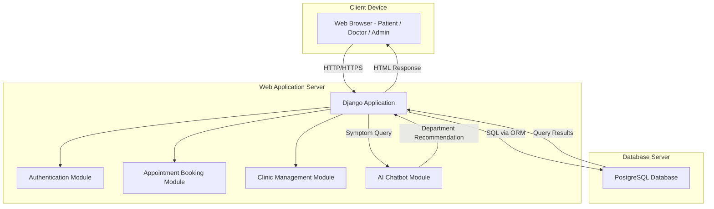

# Title Page

## Change History

## Table of Contents

## List of Figures

## 1. Scope

## 2. References

## 3. Software Architecture

The Online Medical Clinic Reservation System follows a **Layered
(N-Tier) Architecture**, organized into three primary layers that
separate concerns and promote maintainability.

### Architectural Style: Layered Architecture

In a layered architecture, each layer has a specific responsibility
and only communicates with the layer directly adjacent to it. This
makes the system easier to develop, test, and maintain — especially
for a team working in parallel on different components.

### System Layers

| Layer | Technology | Responsibility |
|---|---|---|
| **Presentation Layer** | HTML, CSS, JavaScript | Renders the user interface for patients, doctors, and admins |
| **Application Layer** | Django (Python) | Handles business logic, routing, authentication, and data processing |
| **Data Layer** | PostgreSQL | Persists all system data — users, appointments, schedules, departments |

### Component Overview

The system is composed of the following main components:

- **Public Web Interface:** Accessible to all visitors. Includes Home,
About Us, Departments, Doctors, and Contact pages.

- **Authentication Module:** Manages user registration, login, and
role-based access control for three roles — Patient, Doctor, and Admin.

- **Appointment Booking Module:** Allows patients to search for doctors
by department and specialty, select available time slots, and confirm
bookings. Prevents double-booking through availability validation.

- **Clinic Management Module:** Used by admins to manage doctor
profiles, departments, and schedules.

- **AI Chatbot Module:** A separate component that accepts symptom
input from patients and recommends the appropriate department. It is
intentionally decoupled from the core booking system to maintain
separation of concerns.

### High-Level Architecture Diagram

## 4. Architectural Goals & Constraints

### 4.1 Architectural Goals

The following quality goals shaped the key architectural decisions
made in this system:

| Priority | Goal | Description |
|---|---|---|
| High | **Security** | Patient and medical data must be protected. The system enforces role-based access control (Patient, Doctor, Admin) ensuring users can only access what they are authorized to. Passwords are hashed and sessions are managed securely through Django's built-in authentication framework. |
| High | **Usability** | The system targets non-technical users — patients of a medical clinic. The interface must be simple, intuitive, and accessible through any standard web browser without additional software. |
| High | **Reliability** | Appointment booking must be accurate and consistent. The system must prevent double-booking and ensure that confirmed appointments are always stored correctly. |
| Medium | **Maintainability** | The codebase is structured in clearly separated modules (booking, clinic management, AI chatbot) so that individual components can be updated or extended without affecting others. |
| Medium | **Performance** | The system should respond to user actions promptly. Page loads and booking confirmations should complete within acceptable time for a smooth user experience. |
| Low | **Scalability** | While the current scope is a university project, the layered architecture and modular design allow the system to scale to more users or departments in the future. |

---

### 4.2 Architectural Constraints

Constraints are limitations imposed on the system that shaped
architectural decisions — not choices, but boundaries the team
must work within.

#### Technical Constraints

- **Django Framework:** The backend must be implemented using Django
(Python). This was decided at project inception and is non-negotiable.
- **PostgreSQL Database:** The system uses PostgreSQL as its relational
database. All data relationships (patients, doctors, appointments) must
conform to a structured relational schema.
- **Browser-Based Frontend:** The frontend must run in a standard web
browser using HTML, CSS, and JavaScript — no native mobile apps or
browser plugins required.
- **AI Chatbot Integration:** The chatbot module must integrate with
the Django backend through a defined interface while remaining
independently maintainable.

#### Business Constraints

- **Academic Deadline:** The project must be completed within the
semester timeline. This limits the scope of features and influenced
the choice of familiar, well-documented technologies.
- **Team Size:** The system is built by a five-person student team,
each responsible for a specific component. Architecture must support
parallel development with minimal dependencies between members.
- **No Budget:** The project relies entirely on free and open-source
tools. No paid APIs, cloud services, or licensed software may be used.

#### Regulatory Constraints

- **Data Privacy:** Medical appointment data is sensitive. Even as a
university project, the system design acknowledges that in a real
deployment, patient data would be subject to privacy regulations.
Role-based access control and secure authentication are implemented
with this in mind.

## 5. Logical Architecture

## 6. Process Architecture

## 7. Development Architecture

## 8. Physical Architecture

The Physical Architecture describes the mapping of software
components onto physical hardware nodes and the communication
paths between them. It answers the question: **where does each
part of the system actually run?**

### 8.1 System Nodes

The Online Medical Clinic Reservation System is deployed across
the following physical nodes:

| Node | Description |
|---|---|
| **Client Device** | The end user's machine (laptop, desktop, or mobile). Runs a standard web browser. No installation required. |
| **Web Application Server** | Hosts the Django application. Handles all HTTP requests, business logic, authentication, and routing. |
| **Database Server** | Runs PostgreSQL. Stores and manages all persistent data — users, doctors, appointments, departments, and schedules. |
| **AI Chatbot Module** | A separate Python-based component deployed alongside the Django server. Processes symptom input and returns department recommendations. |

---

### 8.2 Communication Protocols

| Connection | Protocol | Description |
|---|---|---|
| Client → Web Server | HTTP/HTTPS | Browser sends requests; server returns HTML responses |
| Web Server → Database | SQL via Django ORM | Django queries PostgreSQL using its Object-Relational Mapper |
| Web Server → AI Chatbot | Internal Python call | Django invokes the chatbot module directly within the server environment |

---

### 8.3 Deployment Diagram

The following UML deployment diagram illustrates how software
artifacts are distributed across physical nodes and how those
nodes communicate:

---

### 8.4 Physical Architecture Decisions

**Why is the AI Chatbot on the same server as Django?**
For a university-scale project, hosting the chatbot as a separate
deployable module within the same server environment reduces
infrastructure complexity while still maintaining separation of
concerns at the code level. In a production system, it could be
extracted to its own dedicated server or cloud function.

**Why PostgreSQL?**
PostgreSQL is a robust, open-source relational database that
integrates seamlessly with Django through its ORM. The relational
model suits the structured nature of clinic data — patients,
doctors, appointments, and departments all have well-defined
relationships.

**Why browser-based frontend?**
Deploying a web-based frontend requires no installation on the
client device. Any patient or doctor with a standard browser can
access the system — maximizing accessibility with zero client-side
deployment effort.

## 9. Scenarios

## 10. Size and Performance

## 11. Quality

## Appendices

### Acronyms and Abbreviations

### Definitions

### Design Principles

This appendix documents the core design principles that guided
the architectural and development decisions made in the Online
Medical Clinic Reservation System. These principles were not
applied retroactively — they shaped decisions from the beginning
of the design process.

---

#### 1. Separation of Concerns (SoC)

**Definition:** Each component or module of the system should be
responsible for one distinct aspect of functionality, with minimal
overlap between components.

**Application in this system:**
The system is divided into clearly distinct modules — Appointment
Booking, Clinic Management, Authentication, and the AI Chatbot.
Each module handles one domain of functionality and does not
interfere with the others. For example, a change in the AI Chatbot
logic has no impact on the appointment booking workflow.

---

#### 2. Single Responsibility Principle (SRP)

**Definition:** Every module, class, or component should have one
job and one reason to change.

**Application in this system:**
The AI Chatbot module has a single responsibility — analyzing
patient symptoms and recommending a department. It does not handle
booking, authentication, or data management. Similarly, the
Authentication Module is solely responsible for managing user
identity and access — nothing else. If an error occurs in one
module, it does not cascade and break the rest of the system.

---

#### 3. Security by Design

**Definition:** Security measures are built into the architecture
from the beginning — not added as an afterthought.

**Application in this system:**
Security was considered at the design stage across multiple layers:
- **Authentication:** All users must log in before accessing any
protected resource. Django's built-in authentication framework
manages session handling and password hashing.
- **Role-Based Access Control (RBAC):** Three roles are defined —
Patient, Doctor, and Admin. Each role can only access what it is
authorized to. Patients can only view their own appointments and
personal information. Doctors can only manage their own schedules.
Admins have full system access.
- **Data Privacy:** No user can access another user's personal or
medical data — this is enforced at the application logic level
within Django.

---

#### 4. Layered Architecture Principle

**Definition:** The system is organized into distinct layers where
each layer only communicates with the layer directly adjacent to it.

**Application in this system:**
The three-layer structure — Presentation (Frontend), Application
(Django), and Data (PostgreSQL) — ensures that the frontend never
directly accesses the database. All data flows through the Django
application layer, which validates, processes, and controls what
data is read or written. This protects data integrity and makes
each layer independently testable.

---

#### 5. DRY — Don't Repeat Yourself

**Definition:** Every piece of knowledge or logic should exist in
exactly one place in the system. Repetition leads to
inconsistency and maintenance difficulty.

**Application in this system:**
Django's templating system allows shared UI components — such as
the navigation bar, header, and footer — to be defined once and
reused across all pages. Business logic such as availability
checking for appointments is implemented once in the backend and
called wherever needed, rather than duplicated across multiple
views or endpoints.

---

#### 6. Modularity

**Definition:** The system is built as a collection of independent,
interchangeable modules that can be developed, tested, and updated
separately.

**Application in this system:**
The five-person development team worked in parallel by owning
separate modules — Frontend, Appointment Booking Backend, Clinic
Management Backend, and AI Chatbot. Modularity made this possible
because each module had a defined interface and responsibility.
Updating the chatbot algorithm, for example, requires no changes
to the booking or management modules.
