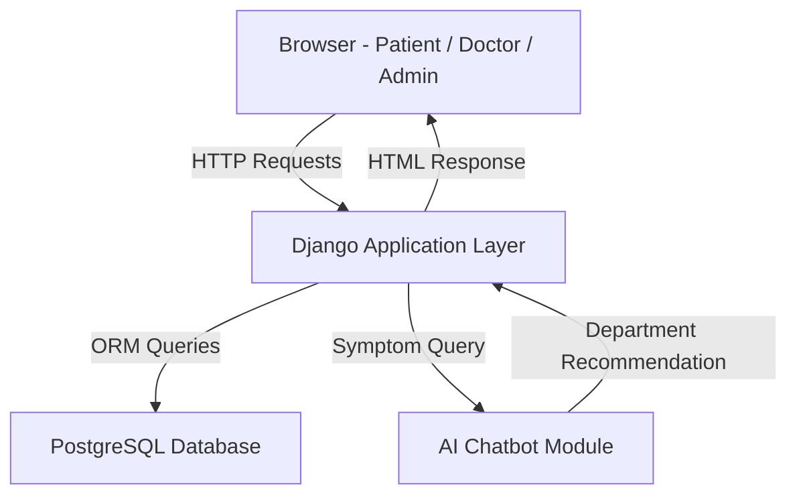
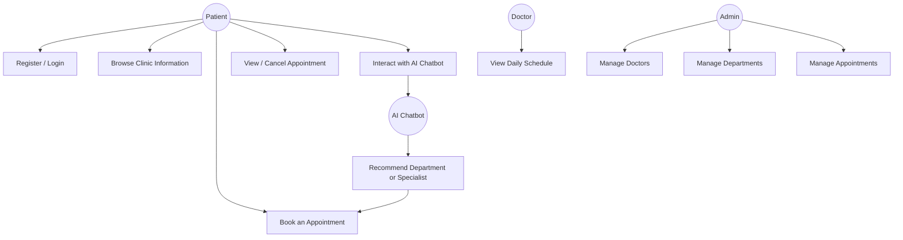
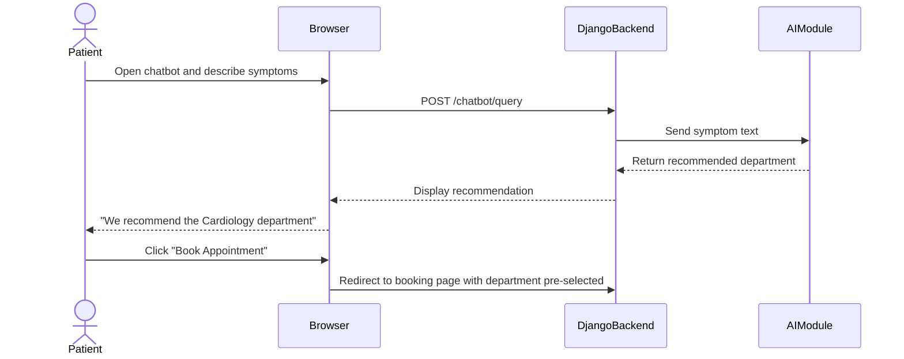
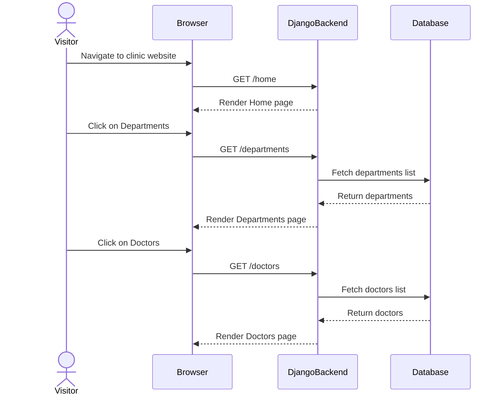

# Online Medical Clinic Reservation System

## Change History

> 👤 [View Git Blame](https://github.com/khairat1/clinic-reservation-system/blame/main/ARCHITECTURE.md)

| Version | Date | Author | Description |
|---|---|---|---|
| 1.0 | April 2026 | Team   | Initial release |

## Table of Contents

1. [Scope](#1-scope)
2. [References](#2-references)
3. [Software Architecture](#3-software-architecture)
4. [Architectural Goals & Constraints](#4-architectural-goals--constraints)
5. [Logical Architecture](#5-logical-architecture)
6. [Process Architecture](#6-process-architecture)
7. [Development Architecture](#7-development-architecture)
8. [Physical Architecture](#8-physical-architecture)
9. [Scenarios](#9-scenarios)
10. [Size and Performance](#10-size-and-performance)
11. [Quality](#11-quality)

## List of Figures

## 1. Scope

This document describes the software architecture of the **Online Medical Clinic
Reservation System**, a web-based platform developed as part of the SWE332 Software
Architecture course at Altınbaş University.

The architecture is documented using the **4+1 Architectural View Model**, covering
the logical, process, development, physical, and scenario views of the system.

### What This Document Covers

- The web application architecture (Django backend, HTML/CSS/JS frontend)
- User authentication and role-based access control (Patient, Doctor, Admin)
- Appointment booking system including double-booking prevention
- Doctor and schedule management (Admin functions)
- AI chatbot assistant for symptom-based department recommendation
- PostgreSQL database structure and data flow
- Deployment configuration for local demonstration

### What This Document Does Not Cover

- Payment processing (not part of the system)
- Mobile application development
- Online/cloud deployment (system is demonstrated locally)
- Email notification integration (optional future feature)
- Multilingual support (optional future feature)
- Data analytics or administrative reporting tools
## 2. References

| ID | Source |
|----|--------|
| [1] | Kruchten, P. (1995). *The 4+1 View Model of Architecture*. IEEE Software, 12(6), 42–50. |
| [2] | Django Documentation. https://docs.djangoproject.com |
| [3] | PostgreSQL Documentation. https://www.postgresql.org/docs |
| [4] | Python Software Foundation. https://www.python.org |
| [5] | Mermaid Diagramming Tool. https://mermaid.js.org |
| [6] | GitHub. https://github.com |

## 3. Software Architecture

The Online Medical Clinic Reservation System follows a **Layered
(N-Tier) Architecture**, organized into three primary layers that
separate concerns and promote maintainability.

### Architectural Style: Layered Architecture

In a layered architecture, each layer has a specific responsibility
and only communicates with the layer directly adjacent to it. This
makes the system easier to develop, test, and maintain — especially
for a team working in parallel on different components.

### System Layers

| Layer | Technology | Responsibility |
|---|---|---|
| **Presentation Layer** | HTML, CSS, JavaScript | Renders the user interface for patients, doctors, and admins |
| **Application Layer** | Django (Python) | Handles business logic, routing, authentication, and data processing |
| **Data Layer** | PostgreSQL | Persists all system data — users, appointments, schedules, departments |

### Component Overview

The system is composed of the following main components:

- **Public Web Interface:** Accessible to all visitors. Includes Home,
About Us, Departments, Doctors, and Contact pages.

- **Authentication Module:** Manages user registration, login, and
role-based access control for three roles — Patient, Doctor, and Admin.

- **Appointment Booking Module:** Allows patients to search for doctors
by department and specialty, select available time slots, and confirm
bookings. Prevents double-booking through availability validation.

- **Clinic Management Module:** Used by admins to manage doctor
profiles, departments, and schedules.

- **AI Chatbot Module:** A separate component that accepts symptom
input from patients and recommends the appropriate department. It is
intentionally decoupled from the core booking system to maintain
separation of concerns.

### High-Level Architecture Diagram



## 4. Architectural Goals & Constraints

### 4.1 Architectural Goals

The following quality goals shaped the key architectural decisions
made in this system:

| Priority | Goal | Description |
|---|---|---|
| High | **Security** | Patient and medical data must be protected. The system enforces role-based access control (Patient, Doctor, Admin) ensuring users can only access what they are authorized to. Passwords are hashed and sessions are managed securely through Django's built-in authentication framework. |
| High | **Usability** | The system targets non-technical users — patients of a medical clinic. The interface must be simple, intuitive, and accessible through any standard web browser without additional software. |
| High | **Reliability** | Appointment booking must be accurate and consistent. The system must prevent double-booking and ensure that confirmed appointments are always stored correctly. |
| Medium | **Maintainability** | The codebase is structured in clearly separated modules (booking, clinic management, AI chatbot) so that individual components can be updated or extended without affecting others. |
| Medium | **Performance** | The system should respond to user actions promptly. Page loads and booking confirmations should complete within acceptable time for a smooth user experience. |
| Low | **Scalability** | While the current scope is a university project, the layered architecture and modular design allow the system to scale to more users or departments in the future. |

---

### 4.2 Architectural Constraints

Constraints are limitations imposed on the system that shaped
architectural decisions — not choices, but boundaries the team
must work within.

#### Technical Constraints

- **Django Framework:** The backend must be implemented using Django
(Python). This was decided at project inception and is non-negotiable.
- **PostgreSQL Database:** The system uses PostgreSQL as its relational
database. All data relationships (patients, doctors, appointments) must
conform to a structured relational schema.
- **Browser-Based Frontend:** The frontend must run in a standard web
browser using HTML, CSS, and JavaScript — no native mobile apps or
browser plugins required.
- **AI Chatbot Integration:** The chatbot module must integrate with
the Django backend through a defined interface while remaining
independently maintainable.

#### Business Constraints

- **Academic Deadline:** The project must be completed within the
semester timeline. This limits the scope of features and influenced
the choice of familiar, well-documented technologies.
- **Team Size:** The system is built by a five-person student team,
each responsible for a specific component. Architecture must support
parallel development with minimal dependencies between members.
- **No Budget:** The project relies entirely on free and open-source
tools. No paid APIs, cloud services, or licensed software may be used.

#### Regulatory Constraints

- **Data Privacy:** Medical appointment data is sensitive. Even as a
university project, the system design acknowledges that in a real
deployment, patient data would be subject to privacy regulations.
Role-based access control and secure authentication are implemented
with this in mind.

## 5. Logical Architecture

### Overview

The Logical Architecture describes the key classes of the Online Medical
Clinic Reservation System, their attributes, responsibilities, and
relationships. It supports the functional requirements by decomposing
the system into meaningful objects derived from the problem domain.

The system follows an object-oriented design. The core entities are
`User`, `Patient`, `Doctor`, `Admin`, `Department`, `Appointment`,
`Schedule`, and `AIChat`. These classes interact to support appointment
booking, clinic management, and AI-assisted department guidance.

### Key Design Decisions

**1. User as a Base Class**
`Patient`, `Doctor`, and `Admin` all inherit from `User`. This avoids
duplicate authentication logic and supports role-based access control
from a single login system. Every actor in the system is a User first,
with their role determining what they can access.

**2. Appointment as a Central Entity**
`Appointment` connects `Patient` and `Doctor`. It is the core
transaction object of the entire system — every booking interaction
passes through it.

**3. Schedule Separate from Appointment**
`Schedule` represents a doctor's general availability (e.g., "every
Monday 9am–12pm"). `Appointment` represents a specific confirmed
booking within that availability. Keeping them separate allows the
system to check availability before confirming a booking, which is
what prevents double-booking.

**4. AIChat Linked to Patient Only**
The AI chatbot exists to guide patients who are unfamiliar with the
clinic structure toward the right department based on their symptoms.
Doctors already belong to a department and need no guidance. Admins
manage the system and have no use for medical recommendations.
Every relationship in a class diagram should exist for a reason —
connecting AIChat to Doctor or Admin would add associations with zero
functional purpose.

### Class Diagram
```mermaid
classDiagram
    class User {
        +int id
        +String username
        +String email
        +String password
        +String role
        +login()
        +logout()
    }

    class Patient {
        +String name
        +String phone
        +Date date_of_birth
        +bookAppointment()
        +cancelAppointment()
    }

    class Doctor {
        +String specialization
        +String bio
        +viewSchedule()
        +manageAppointments()
    }

    class Admin {
        +manageDoctors()
        +manageDepartments()
        +viewAllAppointments()
    }

    class Department {
        +String name
        +String description
    }

    class Appointment {
        +Date date
        +Time time
        +String status
        +String notes
        +confirm()
        +cancel()
    }

    class Schedule {
        +String day_of_week
        +Time start_time
        +Time end_time
    }

    class AIChat {
        +String message
        +String response
        +DateTime timestamp
        +getSuggestion()
    }

    User  "0..*" Appointment : books
    Doctor "1" --> "0..*" Appointment : handles
    Doctor "1" --> "1" Department : belongs to
    Doctor "1" --> "0..*" Schedule : has
    Patient "1" --> "0..*" AIChat : uses

## B. Definitions

| Term | Definition |
|------|------------|
| Appointment | A confirmed booking between a Patient and a Doctor at a specific date and time |
| Authentication | The process of verifying a user's identity via username and password |
| AI Chatbot | An automated assistant that recommends departments based on patient-described symptoms |
| Department | A medical specialty unit within the clinic (e.g., Cardiology, Neurology) |
| Double-Booking | A conflict where two appointments are scheduled for the same doctor at the same time — prevented by the system |
| Django | A Python-based web framework used to build the backend of this system |
| PostgreSQL | The relational database system used to store all clinic data |
| Role-Based Access Control | A security model where system permissions are assigned based on a user's role (Patient, Doctor, Admin) |
| Schedule | A doctor's defined availability — the days and times they are open for bookings |
| UML | Unified Modeling Language — a standard notation for visualizing software architecture |

## 6. Process Architecture

## 7. Development Architecture

## 8. Physical Architecture

The Physical Architecture describes the mapping of software
components onto physical hardware nodes and the communication
paths between them. It answers the question: **where does each
part of the system actually run?**

### 8.1 System Nodes

The Online Medical Clinic Reservation System is deployed across
the following physical nodes:

| Node | Description |
|---|---|
| **Client Device** | The end user's machine (laptop, desktop, or mobile). Runs a standard web browser. No installation required. |
| **Web Application Server** | Hosts the Django application. Handles all HTTP requests, business logic, authentication, and routing. |
| **Database Server** | Runs PostgreSQL. Stores and manages all persistent data — users, doctors, appointments, departments, and schedules. |
| **AI Chatbot Module** | A separate Python-based component deployed alongside the Django server. Processes symptom input and returns department recommendations. |

---

### 8.2 Communication Protocols

| Connection | Protocol | Description |
|---|---|---|
| Client → Web Server | HTTP/HTTPS | Browser sends requests; server returns HTML responses |
| Web Server → Database | SQL via Django ORM | Django queries PostgreSQL using its Object-Relational Mapper |
| Web Server → AI Chatbot | Internal Python call | Django invokes the chatbot module directly within the server environment |

---

### 8.3 Deployment Diagram

The following UML deployment diagram illustrates how software
artifacts are distributed across physical nodes and how those
nodes communicate:

```mermaid
graph TD
    subgraph Client Device
        A[Web Browser - Patient / Doctor / Admin]
    end

    subgraph Web Application Server
        B[Django Application]
        C[Authentication Module]
        D[Appointment Booking Module]
        E[Clinic Management Module]
        F[AI Chatbot Module]
    end

    subgraph Database Server
        G[PostgreSQL Database]
    end

    A -->|HTTP/HTTPS| B
    B --> C
    B --> D
    B --> E
    B -->|Symptom Query| F
    F -->|Department Recommendation| B
    B -->|SQL via ORM| G
    G -->|Query Results| B
    B -->|HTML Response| A
```

---

### 8.4 Physical Architecture Decisions

**Why is the AI Chatbot on the same server as Django?**
For a university-scale project, hosting the chatbot as a separate
deployable module within the same server environment reduces
infrastructure complexity while still maintaining separation of
concerns at the code level. In a production system, it could be
extracted to its own dedicated server or cloud function.

**Why PostgreSQL?**
PostgreSQL is a robust, open-source relational database that
integrates seamlessly with Django through its ORM. The relational
model suits the structured nature of clinic data — patients,
doctors, appointments, and departments all have well-defined
relationships.

**Why browser-based frontend?**
Deploying a web-based frontend requires no installation on the
client device. Any patient or doctor with a standard browser can
access the system — maximizing accessibility with zero client-side
deployment effort.

## 9. Scenarios

The Scenarios view represents the **+1** in the 4+1 Architectural View Model.
It describes the most significant use cases of the system and demonstrates how
the architecture supports them. Each scenario involves one or more actors
interacting with the system, and illustrates how the logical, process,
development, and physical views work together in practice.

---

### 9.1 Use Case Diagram

The following diagram shows the main actors and their interactions with the
Online Medical Clinic Reservation System.


---

### 9.2 Scenario 1: Patient Books an Appointment

**Actor:** Patient
**Goal:** Book an appointment with a doctor by selecting department, date, and time.
**Precondition:** Patient is registered and logged in.


---

### 9.3 Scenario 2: Patient Uses AI Chatbot

**Actor:** Patient
**Goal:** Get a department or specialist recommendation based on symptoms.
**Precondition:** Patient is on the chatbot page.


---

### 9.4 Scenario 3: Patient Browses Clinic Information

**Actor:** Patient (unauthenticated)
**Goal:** Learn about the clinic, departments, and doctors before registering.
**Precondition:** None — public pages are accessible without login.


---

### 9.5 Scenario 4: Admin Manages Doctors and Departments

**Actor:** Admin
**Goal:** Add a new doctor and assign them to a department.
**Precondition:** Admin is logged in with admin privileges.
```mermaid
sequenceDiagram
    actor Admin
    participant Browser
    participant DjangoBackend
    participant Database

    Admin->>Browser: Navigate to Admin Dashboard
    Browser->>DjangoBackend: GET /admin/dashboard
    DjangoBackend-->>Browser: Render Admin Dashboard
    Admin->>Browser: Click "Add Doctor"
    Browser->>DjangoBackend: GET /admin/doctors/add
    DjangoBackend->>Database: Fetch departments list
    Database-->>DjangoBackend: Return departments
    DjangoBackend-->>Browser: Render Add Doctor form
    Admin->>Browser: Fill in doctor details and assign department
    Browser->>DjangoBackend: POST /admin/doctors/add
    DjangoBackend->>Database: Save new doctor
    Database-->>DjangoBackend: Doctor saved
    DjangoBackend-->>Browser: Show success message
    Browser-->>Admin: Doctor added successfully 
    ...

## 10. Size and Performance

## 11. Quality

## Appendices
- [A. Acronyms and Abbreviations](#a-acronyms-and-abbreviations)
- [B. Definitions](#b-definitions)
- [C. Design Principles](#c-design-principles)

### Acronyms and Abbreviations

### Definitions

### Design Principles

This appendix documents the core design principles that guided
the architectural and development decisions made in the Online
Medical Clinic Reservation System. These principles were not
applied retroactively — they shaped decisions from the beginning
of the design process.

---

#### 1. Separation of Concerns (SoC)

**Definition:** Each component or module of the system should be
responsible for one distinct aspect of functionality, with minimal
overlap between components.

**Application in this system:**
The system is divided into clearly distinct modules — Appointment
Booking, Clinic Management, Authentication, and the AI Chatbot.
Each module handles one domain of functionality and does not
interfere with the others. For example, a change in the AI Chatbot
logic has no impact on the appointment booking workflow.

---

#### 2. Single Responsibility Principle (SRP)

**Definition:** Every module, class, or component should have one
job and one reason to change.

**Application in this system:**
The AI Chatbot module has a single responsibility — analyzing
patient symptoms and recommending a department. It does not handle
booking, authentication, or data management. Similarly, the
Authentication Module is solely responsible for managing user
identity and access — nothing else. If an error occurs in one
module, it does not cascade and break the rest of the system.

---

#### 3. Security by Design

**Definition:** Security measures are built into the architecture
from the beginning — not added as an afterthought.

**Application in this system:**
Security was considered at the design stage across multiple layers:
- **Authentication:** All users must log in before accessing any
protected resource. Django's built-in authentication framework
manages session handling and password hashing.
- **Role-Based Access Control (RBAC):** Three roles are defined —
Patient, Doctor, and Admin. Each role can only access what it is
authorized to. Patients can only view their own appointments and
personal information. Doctors can only manage their own schedules.
Admins have full system access.
- **Data Privacy:** No user can access another user's personal or
medical data — this is enforced at the application logic level
within Django.

---

#### 4. Layered Architecture Principle

**Definition:** The system is organized into distinct layers where
each layer only communicates with the layer directly adjacent to it.

**Application in this system:**
The three-layer structure — Presentation (Frontend), Application
(Django), and Data (PostgreSQL) — ensures that the frontend never
directly accesses the database. All data flows through the Django
application layer, which validates, processes, and controls what
data is read or written. This protects data integrity and makes
each layer independently testable.

---

#### 5. DRY — Don't Repeat Yourself

**Definition:** Every piece of knowledge or logic should exist in
exactly one place in the system. Repetition leads to
inconsistency and maintenance difficulty.

**Application in this system:**
Django's templating system allows shared UI components — such as
the navigation bar, header, and footer — to be defined once and
reused across all pages. Business logic such as availability
checking for appointments is implemented once in the backend and
called wherever needed, rather than duplicated across multiple
views or endpoints.

---

#### 6. Modularity

**Definition:** The system is built as a collection of independent,
interchangeable modules that can be developed, tested, and updated
separately.

**Application in this system:**
The five-person development team worked in parallel by owning
separate modules — Frontend, Appointment Booking Backend, Clinic
Management Backend, and AI Chatbot. Modularity made this possible
because each module had a defined interface and responsibility.
Updating the chatbot algorithm, for example, requires no changes
to the booking or management modules.
